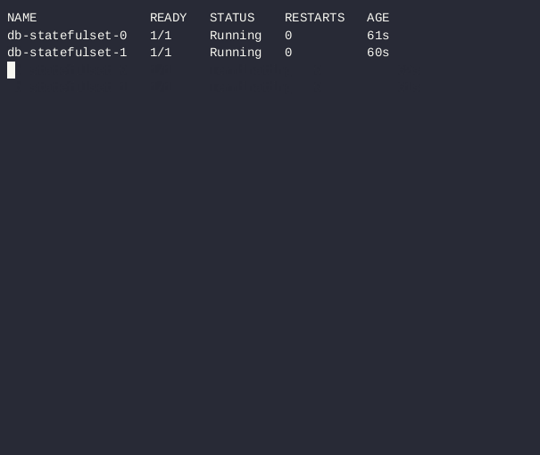

# Laboratoria 3 - Storage i Cron

## Opis czynności i procedury testowe, czyli skąd wiem że działa

### Część na 3.0 

Tutaj był akurat problem mały z tym, że backend zapisywał logi do katalogu `/app` bezpośrednio, zaś zrobienie całego `/app` jako *persistentVolume* niezbyt mi się podobało (no bo w końcu mamy zapisywać logi a nie pliki wykonywalne pythona). W związku z tym zmieniłem lokalizację zapisu logów jako podfolder `/app/log` i dopiero pod ten katalog podpiąłem nasz wolumen.

Po tej modyfikacji można już przetestować rozwiązanie:

1. Wyświetlamy wszyskie pody

       ▶ kubectl get pods

2. Odpalamy na podzie backendu polecenie wyświetlenia zawartości pliku z logami:

       ▶ kubectl exec --stdin --tty <<nazwa poda backendu>> -- cat log/myapp.log

      w pliku powinny być zapisane jakieś logi jeśli apka była używana

3. Zabijamy poda backendu

       ▶ kubectl delete pod <<nazwa poda backendu>>

4. Wykonujemy kroki 1 i 2 ponownie ale tym razem wchodzimy do nowego poda. W pliku powinny pozostać logi sprzed zabicia poda.


#### Przebieg procedury na rzeczywistym systemie powinien wyglądać tak:


### Część na 3.5

Tutaj sprawdzimy tylko czy *persistentVolumeClaim* i *persistentVolume* faktycznie są zbindowane i czy 
*deployment* ich używa.

1. wyświetlamy wszystkie claimy

         ▶ kubectl get pvc

2. wyświetlamy szczegóły naszego claima

         ▶ kubectl describe <<nazwa pvc dla backendu>>


  przykładowy poprawny output:
  ```
    Name:          fiszki-backend-pvc
    Namespace:     fiszkilab2
    StorageClass:  manual
    Status:        Bound                                <<== mówi że wolumen i claim są połączone
    Volume:        fiszki-backend-pv
    Labels:        <none>
    Annotations:   pv.kubernetes.io/bind-completed: yes
                  pv.kubernetes.io/bound-by-controller: yes
    Finalizers:    [kubernetes.io/pvc-protection]
    Capacity:      1Gi
    Access Modes:  RWO
    VolumeMode:    Filesystem
    Used By:       backend-deployment-7c97f9c98d-qjc98  <<== mówi że deployment podpiął się pod wolumen
    Events:        <none>
  ```
### Część na 4.0

Tutaj sprawdzimy trzy rzeczy:
- czy db faktycznie działa
- czy działa persistence
- czy restart po zatrzymaniu działa poprawnie

Co do części pierwszej to sprawdzamy tak jak na poprzednich labach (z poziomu backendu).

Druga i trzecia część są trochę powiązane i można sprawdzić obie rzeczy na raz:

1. tworzymy jakieś wpisy do db z poziomu backendu a następnie pobieramy je i sprawdzamy czy się zgadza.

2. w osobnej konsoli włączamy obserwację podów db:

       ▶ kubectl get pods --watch -l app=fiszki-db

3. zabijamy wszyskie pody db:

       ▶ kubectl delete pod -l app=fiszki-db

4. na watchu patrzymy jak się restartują - pody wstają w kolejności 0,1,2,...,n

    Restart *statefulSeta* z dwoma replikami:

    

5. po restarcie ponownie pobieramy dane z poziomu backendu - powinny być identyczne co przed restartem

### Część na 4.5

Tutaj po prostu uruchamiamy z nowymi ustawieniami i jeśli działa to się cieszymy

### Część na 5.0

Tą część sprawdzamy (a przynajmniej tak mi było najłatwiej) robiąc dodatkowego poda (`dbdump-inspector`) i podpinając do niego
wolumen na który zapisywane są backupy mongo. Następnie można z jego poziomu przeglądać backup bazy danych i logi.
W definicji *cronJoba* ustawione zostało przekierowanie wyjścia do pliku `log.txt`. Przykładowy fragment logów wyświetlony poleceniem:

    ▶ kubectl exec --stdin --tty dbdump-inspector  -- cat /pvc/log.txt

    == DB DUMP START ==
    2024-04-18T16:41:01.078+0200    initializing mongodump object
    2024-04-18T16:41:01.079+0200    will listen for SIGTERM, SIGINT, and SIGKILL
    2024-04-18T16:41:01.088+0200    starting Dump()
    2024-04-18T16:41:01.089+0200    Getting estimated count for students.collections
    2024-04-18T16:41:01.090+0200    enqueued collection 'students.collections'
    2024-04-18T16:41:01.090+0200    dump phase I: metadata, indexes, users, roles, version
    2024-04-18T16:41:01.090+0200            reading indexes for `students.collections`
    2024-04-18T16:41:01.090+0200    dump phase II: regular collections
    2024-04-18T16:41:01.090+0200    finalizing intent manager with legacy prioritizer
    2024-04-18T16:41:01.090+0200    dumping up to 1 collections in parallel
    2024-04-18T16:41:01.090+0200    starting dump routine with id=0
    2024-04-18T16:41:01.097+0200    writing students.collections to /backup/2024-04-18_16-41-01/students/collections.bson
    2024-04-18T16:41:01.097+0200    Getting estimated count for students.collections
    2024-04-18T16:41:01.098+0200    counted 1 document in students.collections
    2024-04-18T16:41:01.099+0200    done dumping students.collections (1 document)
    2024-04-18T16:41:01.099+0200    ending dump routine with id=0, no more work to do
    2024-04-18T16:41:01.099+0200    dump phase III: the oplog
    2024-04-18T16:41:01.099+0200    finishing dump
    == DB DUMP END ==

zaś zawartość całego katalogu z backupami wyświetlić można w następujący sposób:

    ▶ kubectl exec --stdin --tty dbdump-inspector  -- ls /pvc/   

    2024-04-18_14-24-01  2024-04-18_14-33-01  2024-04-18_16-41-01
    2024-04-18_14-27-01  2024-04-18_14-36-01  log.txt
    2024-04-18_14-30-01  2024-04-18_14-39-01

żeby sprawdzić czy backup faktycznie się wykonał można sprawdzić zawartość pliku `/pvc/2024-XX-XX_XX-XX-XX/students/collections.bson`. Z uwagi że jest to blik BSON (czyli Binary JSON) to otwieranie go notatnikiem daje mierne efekty. Aby lepiej zbadać zawartość pliku (`cat`em też można ale jest pełno błędnych znaków) można otworzyć go
`bsondump`em będącym częścią zestawu narzędzi MongoDB. Aby to zrobić najpierw kopiujemy plik z kontenera na lokalną maszynę poleceniem

    ▶ kubectl cp dbdump-inspector:/pvc/<<nazwa katalogu z backupem>>/students/collections.bson db.bson

a następnie otwieramy poleceniem `bsondump` formatującym zawartość bazy jako obiekt JSON:

    ▶ bsondump --pretty db.bson 

       {
              "_id": {
                     "$oid": "661d986c37a90fe8dffa0f15"
              },
              "user_id": "-1",
              "title": "Wanna pass dog you",
              "isPublic": true,
              "tags": [
                     "tag1",
                     "tag2",
                     "tag3"
              ],
              "flashCards": [
                     {
                            "id": {
                                   "$binary": {
                                          "base64": "rH7AQROuSWeEudZplVD/rw==",
                                          "subType": "04"
                                   }
                            },
                            "question": "WHat is the reason that you are here",
                            "answers": [
                                   {
                                          "answer": "To be cool",
                                          "isCorrect": true
                                   },
                                   {
                                          "answer": "To be bad",
                                          "isCorrect": false
                                   },
                                   {
                                          "answer": "To be happy",
                                          "isCorrect": true
                                   }
                            ]
                     }
              ]
       }
       2024-04-19T00:10:32.771+0200    1 objects found

żeby sprawdzić samego *cronJoba* czy uruchamia się o poprawnych godzinach wystarczy wykonać

    kubectl get cronjobs

i sprawdzić czy na wyjściu jest wszystko poprwanie. Jeśli dany *cronJob* już miał okazję się uruchomić będzie
można łatwo sprawdzić czy godzina jest poprwana. Przykładowy output wyglądać może tak:

    NAME                   SCHEDULE    SUSPEND   ACTIVE   LAST SCHEDULE   AGE
    fiszki-db-backup-job   0 2 * * *   False     0        9h35m           22h

można też sprawdzić same instancje *jobów* (tutaj są akurat dwa bo włączyłem automatyczne usuwanie starszych)

    ▶ kubectl get jobs    

    NAME                            COMPLETIONS   DURATION   AGE
    fiszki-db-backup-job-28557519   1/1           3s         9h35m
    fiszki-db-backup-job-28557521   1/1           3s         11h35m


# ♫ To już jest koniec, nie ma już nic ♫