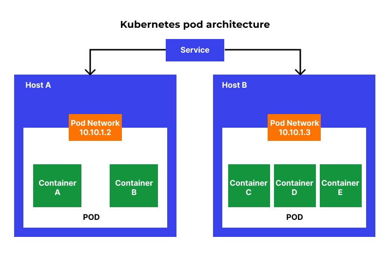

# Laboratorium 2 - podstawy Kubernetes 

## Wstęp
Pora wypuścić was na coś odrobinę ambitniejszego ale jeszcze bez przesady. 

## Założenia Kubernetesa i czym są Pody
<p style="text-align:justify">    
Kubernetes jest otwartoźródłowym systemem służącym do automatyzacji wdrażania, skalowania oraz zarządzania aplikacjami kontenerowymi. Pozwala on na łatwe zarządzanie grupami kontenerów działającymi na wielu serwerach, oferując przy tym mechanizmy dla zapewnienia dostępności, skalowalności i bezpieczeństwa aplikacji. Kubernetes abstrahuje złożoność zarządzania infrastrukturą, umożliwiając szybkie dostosowanie się do zmieniających się potrzeb aplikacji oraz optymalizację wykorzystania zasobów.
</p>
<p style="text-align:justify">    
Pody są podstawowymi jednostkami w Kubernetesie, które reprezentują procesy działające na klastrze. Pod to grupa jednego lub wielu kontenerów, które są współlokowane na tym samym hoście i mogą współdzielić zasoby, takie jak sieć i przestrzeń dyskowa. Kontenery w ramach tego samego Poda są zawsze planowane razem na tym samym węźle i działają w tej samej lokalnej sieci, co pozwala im komunikować się między sobą za pomocą localhost.



</p>

## Przykłady zasobów w yaml'u
### Serwis
```
apiVersion: v1
kind: Service
metadata:
  name: my-service
spec:
  type: LoadBalancer
  selector:
    app: moja-apka
  ports:
    - protocol: TCP
      port: 80
      containerPort: 30001
```

- jest typu `LoadBalancer` czyli technologia chmurowa (AWS, GKE czy Azure) zarządza ruchem który trafia do podów. Może też służyć do udostępniania aplikacji na świat (lecz jedynie w przypadku gdy pracujemy w jakiejś chmurze). W czasie laboratoriów okażą się dla was przydatne głównie typ `ClusterIP` oraz `NodePort`
    - `ClusterIP` - udostępnia serwis wewnątrz klastra kubernetesowego. Różne deploymenty mogą się do niego łączyć lecz nie można się dostać do aplikacji z poziomu przeglądarki.
    - `NodePort` - Udostępnia usługę na adresie IP każdego węzła na statycznym porcie (NodePort). Aby udostępnić port węzła, Kubernetes konfiguruje adres IP klastra.

- `selector app: moja-apka` - mówi tworzonemu serwisowi, pod jaką nazwę ma się podłączyć (czyli na przykład udostępniać wybrane porty na świat)

- `ports` - definiuje jakie porty udostępnić i pod jakim protokołem 

- `metadata` - jest to sekcja w której definiujecie najczęściej: nazwę zasobu i przestrzeń nazw (namespace) do której ma przynależeć. 
### Kontrolery
```
apiVersion: apps/v1
kind: Deployment
metadata:
  name: frontend-deployment
  namespace: apka
  labels:
    app: frontend
spec:
  replicas: 1
  selector:
    matchLabels:
      app: frontend
  template:
    metadata:
      labels:
        app: frontend
    spec:
      containers:
      - name: frontend-service
        image: fiszki_app:latest
        imagePullPolicy: mi
        ports:
        - containerPort: 80

```

<p style="text-align:justify">    
Są to zasoby które mają monitorować czy stan jaki zdefiniowaliśmy jest osiągnięty (Na przykład czy nasz backend żyje, udostępnia odpowiednie porty, ma przekazane odpowiednie zmienne) A jeżeli chodzi o opis powyższego zasobu:

</p>

- `kind`: Określa typ obiektu Kubernetes. Tutaj jest to `Deployment`, co oznacza, że definiuje się zasady dla wdrożenia aplikacji.
- `metadata`: Metadane obiektu, takie jak nazwa, przestrzeń nazw, etykiety. 
- `spec`: Specyfikacja wdrożenia, określająca oczekiwany stan wdrożenia.

  - `replicas`: Określa liczbę replik podów dla wdrożenia (tu 1).
  
  - `selector`: Określa, które podzbiory powinny zostać wybrane do wdrożenia.
    
    - `matchLabels`: Definiuje warunki, które powinny być spełnione przez etykiety podów, aby zostały wybrane.

      - `app: frontend`: Wymaga, aby wybrane pody miały etykietę `app` ustawioną na `frontend`.
      
  - `template`: Szablon konfiguracji nowych podów utworzonych przez wdrożenie.

    - `metadata`: Metadane szablonu.
      
      - `labels`: Etykiety przypisane do podów tworzonych przez ten szablon.
      
        - `app: frontend`: Etykieta `app` ustawiona na `frontend`.
        
    - `spec`: Specyfikacja podów utworzonych przez ten szablon.
      
      - `containers`: Lista kontenerów w podzie.
        
        - `name`: Nazwa kontenera (`frontend-service`).
        - `image`: Obraz Dockerowy używany do utworzenia kontenera (`fiszki_app:latest`).
        - `imagePullPolicy`: Określa, kiedy Kubernetes ma pobrać obraz (`IfNotPresent`, pobierze tylko wtedy, gdy nie ma go lokalnie).
        - `ports`: Lista portów, które kontener nasłuchuje.

          - `containerPort: 80`: Port, na którym kontener nasłuchuje komunikacji (port 80).

## Podstawowe komendy
### Listowanie zasobów 

```
kubectl get <nazwa_typu_zasobu> <opcje> 
```
Komenda ta zwróci wam listing typu zasobu jaki potrzebujecie, domyślnie dla namespace'a **default**.
#### Flagi które może się wam przydadzą 
- `--namespace` - przestrzeń nazw z której chcemy zobaczyć zasób
- `--output` - format w jakim zwróci nam komenda wybrane zasoby. Część ze wspieranych opcji: `json|yaml|wide|name|` 
#### Przykładowe wywołanie komend 

```
kubectl get pods
```
```
kubectl get deployments --namespace <twoj_namespace>
```
### Szczegóły na temat zasobu
```
kubectl describe <typ_zasobu> <nazwa_zasobu> <opcje>
```
Komenda ta zwraca nam konkretną konfigurację wybranego przez nas zasobu, bądź zestawu zasobów. (informację np z jakiego jest namespace'a, jakie ma przydzielone zasoby, wydarzenia jakie się zdarzyły itd)

#### Przykładowe wywołania
- Zwrócenie konfiguracji podów (będą listowane jeden pod drugim)
```
kubectl describe pod 
```
- Zwrócenie konfiguracji konkretnego poda 
```
kubectl describe nginx
```
### Usunięcie zasobu 
Usuwamy zasób z kubernetesa. Potrzebujemy wiedzieć jego typ i nazwę, możemy też podać różne opcje

```
kubernetes delete <typ_zasobu> <nazwa_zasobu> <flagi>
```

#### Flagi 

- `--all:` Usuwa wszystkie zasoby określonego typu w bieżącej przestrzeni nazw.
- `--namespace lub -n`: Określa przestrzeń nazw, z której mają być usuwane zasoby.
- `--selector lub -l`: Usuwa zasoby, które pasują do określonych selektorów etykiet.
- `--grace-period`: Określa czas (w sekundach), jaki Kubernetes ma czekać przed wymuszeniem usunięcia zasobu. Użycie wartości 0 wymusza natychmiastowe usunięcie.
- `--force`: Używane do wymuszenia usunięcia zasobu, może być potrzebne w niektórych przypadkach, aby natychmiast usunąć zasób bez czekania na jego normalne zamknięcie.

#### Przykładowe wywołania 
```
kubectl delete pods --all
```

```
kubectl delete pod my-pod-name --force 
```

### Tworzenie zasobów w kubernetesie

#### Z pliku 

```
    kubectl create -f [plik.yaml]
```
#### Z linii komend 
```
kubectl create <typ_zasobu> <nazwa_zasobu> <flagi>
```


#### Opcje 
Dla konkretnych zasobów mogą być dostępne konkretne opcje, podaje się je  po nazwie zasobu wraz z flagami. Opcje defaultowe: 
- `--filename lub -f`: Ścieżka do pliku konfiguracyjnego zawierającego definicję zasobu do utworzenia. Można podać wiele plików oddzielając je przecinkami lub używając flagi wielokrotnie.
- `--dry-run`: Symulacja tworzenia zasobu. Przydatne do weryfikacji definicji zasobu bez rzeczywistego tworzenia go w klastrze.
- `--output lub -o`: Określa format wyjściowy polecenia. Przykłady wartości to yaml, json, które pozwalają zobaczyć, co zostanie utworzone, bez rzeczywistego tworzenia zasobu.

#### Przykłady 

Tworzenie deploymentu z pliku. Jak może wyglądać przykładowy plik można znaleźć [tutaj](https://kubernetes.io/docs/concepts/workloads/controllers/deployment/#creating-a-deployment)
```
kubectl create -f deployment.yaml
```
Tworzenie poda z linii poleceń.

```
kubectl create pod my-pod --image=nginx
```

Tworzenie namespace'a z linii poleceń
```
kubectl create namespace my-namespace
```


### Kubernetes apply

Jest to alternatywa dla komendy `kubernetes create`. Najważniejsze róznice pomiędzy tymi dwiema komendami, które was będą interesować w czasie labów to:
- `kubectl create` zwróci błąd, jeżeli będziecie chcieli stworzyć zasób o nazwie która już istnieje w danym namespace'ie, a `apply` przejdzie dalej
- `kubectl apply` zezwala na podanie w parametrze -f katalogu gdzie znajdują się wszystkie yaml'e z których chcecie stworzyć aplikację   

#### Przykład komendy

```
kubectl apply -f ./ 
```

```
kubectl apply -f my_deployment.yaml
```


Po więcej komend opcji itd odsyłam do [dokumentacji](https://kubernetes.io/docs/reference/generated/kubectl/kubectl-commands)


## Wymagane narzędzia, repozytoria, etc
- Zainstalowane:
    - Docker
    - Minikube bądź ekwiwalent.
    - kubectl

- Repozytorium projektu.

- Polecam mieć zainstalowanego VSC'ode'a ze rozszerzeniem `Kubernetes` (Przynajmniej wam powie czy jakiś błąd robicie podczas modyfikowania yamli).

### Jak sprawdzić czy nasz minikube działa.

```
minikube start
```

```
minikube dashboard
```
Zostanie wtedy odpalona strona internetowa zawierająca widok na to co zawiera w sobie minikube (czyli wszystkie pody, deploye i innego typu zasoby)

### Dodatkowe opcje konfiguracyjne które musicie zrobić

Z racji tego że pracujemy na naszym lokalnym rejestrze to trzeba włączyć opcję w minikubie aby szukał wpierw obrazów na naszym lokalnym rejestrze dockerowym.
Kroki jakie trzeba podjąć.

1. W zależności od systemu operacyjnego wrzucić odpowiednią komendę w terminal:
  - linux: `eval $(minikube docker-env)`
  - Windows: `minikube docker-env | Invoke-Expression`
2. Następnie włączyć minikube'a za pomocą komendy `minikube start`
3. Zbudować obraz aplikacji którą będziemy trzymać w lokalrnym rejestrze.
4. Aby sprawdzić czy nasz obraz jest w lokalnym rejestrze należy użyć komendy `minikube image ls`


## Zadania

### Komentarz: 
<p style="text-align:justify">    

W przypadku robienia zadania **tylko** na 3.0 oprócz prezentacji chciałbym pdf'a ze screenami z jedno-zdaniowymi komentarzami co widać na screenie.

Jeżeli macie ambicje chociaż na 3.5 to zadanie z 3.0 nadal chciałbym abyście wykonali, lecz nie wymagam otrzymania z niego pdf'a. Jako podkładkę pod ocenę wtedy chcę jedynie pliki yaml'owe które wygenerujecie w trakcie pracy. 

Dla osób które zdecydują się pisać wszystko poprzez `kubectl create`: Aby stworzyło wam zasób oraz wygenerowało yaml'a wystarczy że dodacie flagę `-o` tak jak wspomniano [tutaj](#tworzenie-zasobów-w-kubernetesie)

</p>

### 3.0 - Hello world w Kubernetesie czyli ćwiczenie podstawowych komend. 
Zadanie na minimum to jest zapoznanie się z podstawowymi komendami z kubectl'a.

Wasze zadanie:
<!-- 1. Stworzenie poda i wykonanie na nim kilku operacji.
- Stworzyć Poda z nginx'em:
    ```
    kubectl run nginx --image=nginx
    ```
- Pokazać że ten pod istnieje. 
- Wejść do poda i podejrzeć logi.
- Usunąć poda. -->

1. Stworzenie prostego deployment'u.
- Tym razem tworzymy deployment z nginx'em
```
kubectl create deployment nginx-deployment --image=nginx
```
- wylistuj pody aby zobaczyć że powstał jeden pod z nginx'em 
```
kubectl get pods
```

- Zeskaluj  deployment a następnie zobacz czy zostały utworzone dodatkowe dwa pody. W ramach tego podzadania też sprawdź co się stanie jeżeli któryś z podów usuniesz. 
``` 
kubectl scale deployment nginx-deployment --replicas=3 
```
- Na sam koniec przygody stwórz serwis który udostępni nginx'a tak aby dało się do niego dostać z poziomu przeglądarki. 
``` 
kubectl expose deployment nginx-deployment --port=80 --type=LoadBalancer 
```
(Aby sprawdzić czy faktycznie udostępniliście porty można użyć chociażby komendy `minikube service --all`)

- Nie jest to obowiązkowe ale na koniec możecie usunąć ten deployment komendą `kubectl delete deployment nginx-deployment`

### Stworzenie własnego deploymentu aplikacji 
- Do zadania można podejść od zarówno od strony komend jak i pisania samemu yamli. Przykładowe wzorce do napisania własnych plików yamlowych znajdziecie na stronie [dokumentacji](https://kubernetes.io/docs/concepts/workloads/controllers/deployment/) wpisując w wyszukiwanie nazwę zasobu który chcecie stworzyć
- Jednakże jeżeli zdecydujecie się na generacje wszystko linią komend to oczekuję, że na koniec wygenerujecie mi yamle stworzonych deployment'ow serwisów itd. 

#### 3.5 - Part 1 
Stwórz deployment backend-end'u aplikacji z poprzednich laboratoriów. Dodaj do niego serwis (ang. Service), który zezwoli na dostanie się do strony internetowej. 

Podpowiedzi: 
- Kontener od backendu działa na porcie `8000`, wy macie przekierować port tak aby od strony przeglądarki dało się dostać od jakiegokolwiek portu jaki sobie wybierzecie (np. `3000, 8001` itd.) 
- W serwisie będziecie chcieli wykorzystać typ `NodePort`, gdyż on udostępnia porty na zewnątrz pod'a
- Aby sprawdzić czy utworzony przez Ciebie serwis udostępnia aplikację polecam użyć poniższej  komendy:
```
  minikube service <nazwa_serwisu>  
```

#### 4.0 - Part 2 
Wprowadź zmiany na dla deploymentu aby nie był publikowany w domyślnym namespac'ie kubernetesa.

Kroki jakie należy po krótce podjąć:
- Stworzyć nowy namespace.
- W zależności od ścieżki przez was wybranej:
    - Linią komend można zmienić kontekst w którym działacie za pomocą komendy `kubectl config set-context --current --namespace=<nazwa_namespace>`. Od tej pory wszystko co tworzycie będziecie tworzyć w ustawionym namespace'ie
    - W przypadku pisania plików yamlowych należy dodać nową sekcję `"metadata"` w której później należy podać pod kluczem `"namespace"` 
- Następnie można stworzyć deployment i service tak jak w części na 3.5. 

#### 5.0 - Part 3
Stwórz deployment dla bazy danych i spraw aby był w stanie odbierać requesty od backend'u.
Chcemy aby nasza baza danych mogła odbierać requesty tylko od backend'u i żeby nikt inny nie mógł się do niej dostać.

Kroki jakie trzeba podjąć:
- Stworzyć deployment dla bazy danych w tym samym namespace'ie co baza danych i aby udostępniała port `27017`
- Stworzyć serwis, który będzie udostępniał port i IP deploymentu bazy danych innym deployment'om w klastrze kubernetesowym. 
- Zmodyfikować deployment backend'u, poprzez dodanie zmiennej środowiskowej która będzie nakierowywać do bazy danych.

Podpowiedzi:
- Typ serwisu który chcecie stworzyć to `ClusterIP`
- Aby wiedzieć jakie IP potem przekazać w deploymencie backendu może się okazać pomocna komenda `kubectl get SVC`. Może się też zdarzyć że wam po IP nie będzie działać. Możecie wtedy spróbować po nazwie serwisu. 

**Zbyteczny** komentarz od prowadzącego: W komercyjnym świecie jako devopsi byście mieli postawić bazę danych jako StatefullSet, ale żeby nie utrudniać nam życia tworzymy to na razie jako zwykły deployment. 


## Przydatne linki podczas pracy w laboratorium.

- Dokumentacja kubernetesa zawiera przykłady zasobów do każdego z zadań dla oceny 3.0<. [Link](https://kubernetes.io/docs/home/)


## Dodatkowe materiały dla poszerzenia wiedzy
- Ładne porównanie typów [serwisów](https://kodekloud.com/blog/clusterip-nodeport-loadbalancer/)
- Wyjaśnienie kontrolerów i ich różnic [link](https://semaphoreci.com/blog/replicaset-statefulset-daemonset-deployments)
- ogólnie fajny kanał do nauki [Kubernetesa](https://www.youtube.com/@TechWorldwithNana) 
